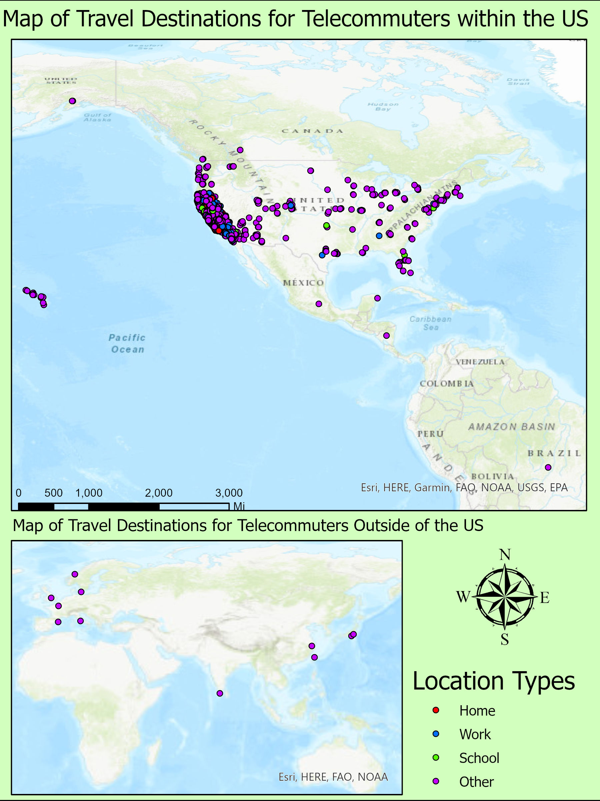

These are some projects I've done through out my time at UCSB.

## Geog 199

This is an independent studies class I took with Kostas Goulias. Here I had to go through NHTS data to create a spatial distribution of telecommuters and commuters. I did this in ArcMap, but it would have been easier to start in R, and use ArcMap to put the final aesthetics on. This took me way to long to make for how simple they are:

##I intend to put more stuff here later.